# Reminisce

> AI memory that thinks like a human brain

Reminisce is a cognitive science-inspired memory architecture for AI systems. Instead of a single vector store, it implements distinct memory types that work together -- just like human memory. It runs as a cloud-native service on Cloudflare (D1 + Vectorize + Workers AI) with local SQLite fallback, and is automatically populated by Claude Code session hooks.

*In development since January 2026. Originally "MLMS" (Multi-Layer Memory System), rebranded to Reminisce on January 31, 2026.*

**Paper:** [Reminisce: A Cognitive Science-Inspired Memory Architecture for AI Agents](paper/reminisce.pdf) | [Benchmark Results (HuggingFace)](https://huggingface.co/datasets/myronkoch/reminisce-longmemeval-results)

---

## Table of Contents

1. [Overview](#overview)
2. [System Architecture](#system-architecture)
3. [How Reminisce Gets Populated](#how-reminisce-gets-populated)
4. [Cloud Infrastructure](#cloud-infrastructure)
5. [D1 Database Schema](#d1-database-schema)
6. [Vectorize Configuration](#vectorize-configuration)
7. [Authentication](#authentication)
8. [Cloud API Reference](#cloud-api-reference)
9. [Dashboard](#dashboard)
10. [Memory Router Integration](#memory-router-integration)
11. [Cognitive Memory Architecture](#cognitive-memory-architecture)
12. [MCP Tools Reference](#mcp-tools-reference)
13. [Memory Model](#memory-model)
14. [Data Quality Pipeline](#data-quality-pipeline)
15. [Packages](#packages)
16. [Configuration](#configuration)
17. [Development](#development)
18. [Troubleshooting](#troubleshooting)

---

## Overview

Current AI memory solutions (Mem0, Zep, etc.) treat memory as a monolithic vector store. But human memory is not one system — it is multiple specialized systems working together:

| Memory Type | Human Analog | Function | Reminisce Package |
|-------------|--------------|----------|-------------------|
| **Working Memory** | Prefrontal Cortex | Active task context (7 items, fast) | `@reminisce/working` |
| **Episodic Memory** | Hippocampus | "What happened when" (events, timeline) | `@reminisce/episodic` |
| **Semantic Memory** | Neocortex | Facts and relationships (knowledge) | `@reminisce/semantic` |

### Key Features

- **Cloud-native** — D1 (SQLite-compatible) + Vectorize (768-dim vector search) + Workers AI embeddings
- **Multi-machine** — Desktop/Laptop (or any machine) write to the same cloud store via API keys
- **Automatic population** — Claude Code Stop hook extracts episodes and facts from every session
- **Multi-layer architecture** — Right memory type for each task
- **Salience scoring** — Importance-based retention, not just recency
- **Provenance tracking** — Every fact traces back to source episodes
- **Contradiction detection** — Semantic store detects conflicting facts
- **MCP compatible** — Works with Claude Code, Claude Desktop, and any MCP client
- **Local fallback** — SQLite + sqlite-vec when cloud is unreachable
- **Web dashboard** — Browse episodic timeline, semantic facts, knowledge graph, and stats

---

## System Architecture

### End-to-End Data Flow

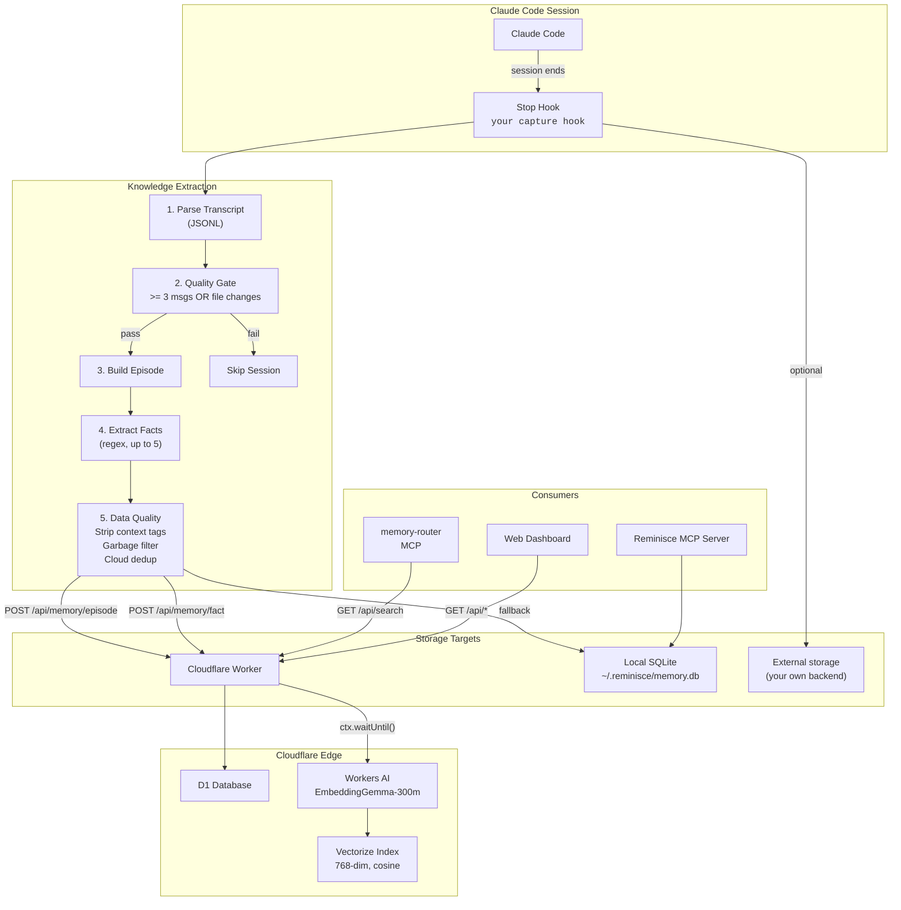

### Component Overview

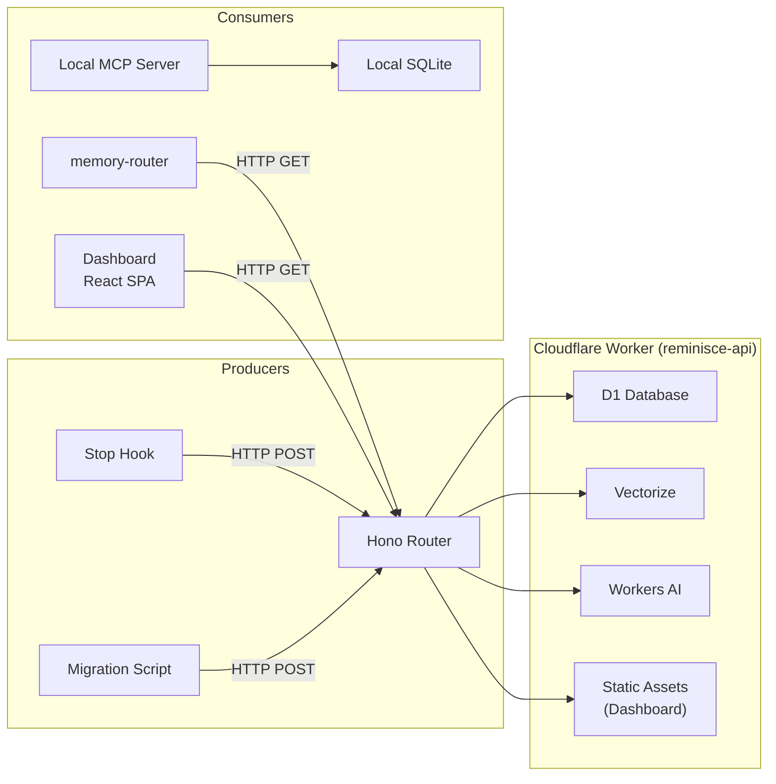

---

## How Reminisce Gets Populated

Reminisce is populated **automatically** by a Claude Code hook that fires at the end of every session. No manual intervention needed - if you use Claude Code, Reminisce learns from your sessions.

### The Hook

The capture hook is a Claude Code `Stop` event handler (fires after every assistant response). You register it in your Claude Code settings under `hooks.Stop`. See the hooks section of this README for what the capture script needs to do.

**What you need to provide:**
- A hook script that parses the session transcript (JSONL format from Claude Code)
- Your `REMINISCE_API_URL` and `REMINISCE_API_KEY` environment variables
- (Optional) A fallback SQLite path via `REMINISCE_DB_PATH`

### Pipeline

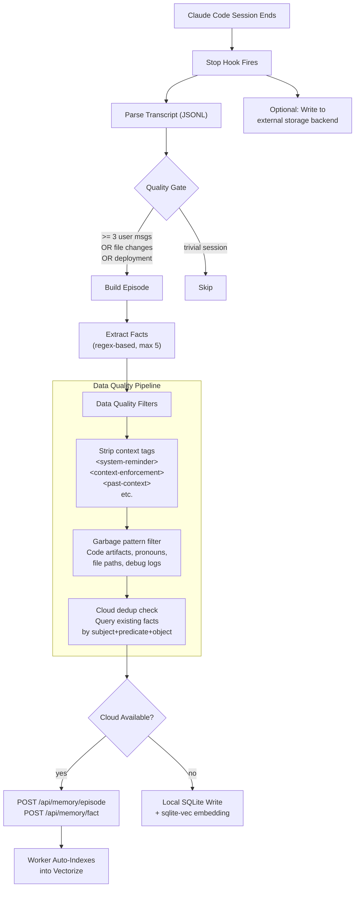

### Fact Extraction Patterns

The hook uses regex-based extraction to pull structured facts from session transcripts:

| Category | Pattern Examples | Confidence | SPO Triple |
|----------|-----------------|------------|------------|
| Decisions | "we decided to X", "going with X" | 0.70 | `{project} decided_to {content}` |
| Technical | "the problem was X", "fixed by X" | 0.75 | `{project} has_finding {content}` |
| Architecture | "deployed to X", "architecture uses X" | 0.65 | `{project} architecture_detail {content}` |
| Preferences | "I prefer X", "don't use X" | 0.80 | `user prefers {content}` |

Facts are deduplicated within each session and capped at 5 (sorted by confidence).

### Embedding Strategy

All embeddings use **EmbeddingGemma-300m (768 dimensions)**. No other model is permitted.

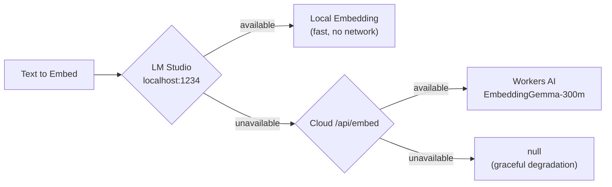

### What Gets Captured Per Session

| Item | Count | Destination |
|------|-------|-------------|
| Episode | 1 | Reminisce (cloud or local) |
| Facts | 0-5 | Reminisce (cloud or local) |
| Observation | 1 | Optional external storage |

---

## Cloud Infrastructure

Reminisce runs as a Cloudflare Worker at `your-worker.your-domain.com`.

### Infrastructure Diagram

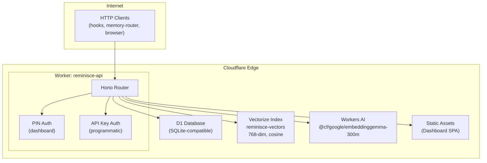

### wrangler.toml Bindings

| Binding | Type | Resource | Description |
|---------|------|----------|-------------|
| `DB` | D1 Database | `reminisce-memory` | Primary data store (episodes, facts, tenants) |
| `VECTORIZE` | Vectorize | `reminisce-vectors` | 768-dim cosine similarity vector index |
| `AI` | Workers AI | (built-in) | EmbeddingGemma-300m for embedding generation |
| `ASSETS` | Static Assets | `./public` | Dashboard SPA (React + Vite build output) |

### Multi-Machine Setup

Each machine gets its own API key. All machines write to the same D1 database and Vectorize index, isolated by tenant namespace.

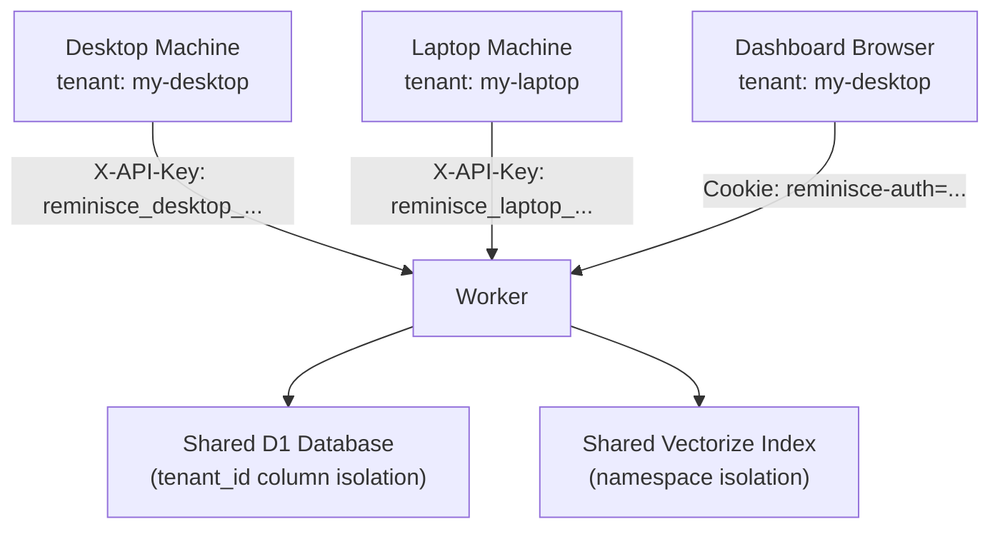

Each machine gets its own API key. All machines write to the same D1 database and Vectorize index, isolated by tenant namespace. The tenant IDs are arbitrary strings you define when inserting rows into the `tenants` D1 table.

| Machine | Tenant ID | Purpose |
|---------|-----------|---------|
| Desktop | `my-desktop` | Primary workstation |
| Laptop | `my-laptop` | Mobile workstation |
| Dashboard (PIN) | `my-desktop` | Web UI (maps to primary tenant) |

### Auto-Indexing on Write

When a record is written via `POST /api/memory/episode` or `POST /api/memory/fact`, the Worker automatically:

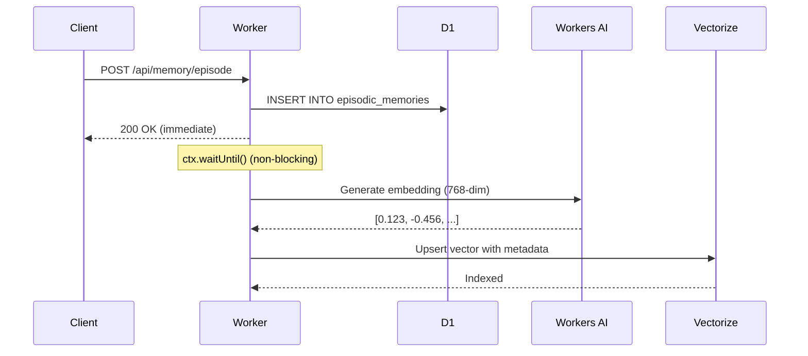

1. Writes the record to D1
2. Returns `200 OK` immediately
3. Generates an embedding via Workers AI (non-blocking via `ctx.waitUntil()`)
4. Upserts the vector into Vectorize with tenant namespace

The hook doesn't need to generate embeddings for cloud writes — the Worker handles it.

---

## D1 Database Schema

Three tables, all tenant-isolated via `tenant_id` column:

### `episodic_memories`

Stores events/experiences with temporal context.

| Column | Type | Description |
|--------|------|-------------|
| `id` | TEXT PK | UUIDv7 (time-sortable) |
| `tenant_id` | TEXT NOT NULL | Tenant isolation |
| `machine_id` | TEXT NOT NULL | Source machine identifier |
| `session_id` | TEXT NOT NULL | Claude Code session ID |
| `layer` | TEXT | Always `'episodic'` |
| `event` | TEXT NOT NULL | Event type (e.g., `"reminisce: Deployed migration"`) |
| `summary` | TEXT NOT NULL | What happened in the session |
| `entities` | TEXT (JSON) | Array of entities involved |
| `valence` | REAL | Emotional valence (0-1) |
| `tags` | TEXT (JSON) | Array of tags |
| `consolidated` | INTEGER | Whether episode has been consolidated to semantic |
| `started_at` | TEXT | Session start timestamp |
| `ended_at` | TEXT | Session end timestamp |
| `provenance` | TEXT (JSON) | Source tracking, confidence, retraction status |
| `salience` | TEXT (JSON) | Importance signals and computed score |
| `created_at` | TEXT | Record creation timestamp |
| `updated_at` | TEXT | Last modification timestamp |

**Indexes:** `(tenant_id)`, `(tenant_id, session_id)`, `(tenant_id, created_at)`

### `semantic_memories`

Stores distilled facts as subject-predicate-object triples.

| Column | Type | Description |
|--------|------|-------------|
| `id` | TEXT PK | UUIDv7 |
| `tenant_id` | TEXT NOT NULL | Tenant isolation |
| `machine_id` | TEXT NOT NULL | Source machine |
| `session_id` | TEXT NOT NULL | Source session |
| `layer` | TEXT | Always `'semantic'` |
| `fact` | TEXT NOT NULL | Human-readable fact text |
| `subject` | TEXT | SPO subject (e.g., `"user"`, `"reminisce"`) |
| `predicate` | TEXT | SPO predicate (e.g., `"prefers"`, `"decided_to"`) |
| `object` | TEXT | SPO object (e.g., `"bun"`, `"D1 over KV"`) |
| `category` | TEXT | Category (e.g., `"preferences"`, `"decisions"`) |
| `source_episode_ids` | TEXT (JSON) | Array of source episode MemoryIDs |
| `tags` | TEXT (JSON) | Array of tags |
| `provenance` | TEXT (JSON) | Source tracking, confidence |
| `salience` | TEXT (JSON) | Importance signals and score |
| `created_at` | TEXT | Record creation timestamp |
| `updated_at` | TEXT | Last modification timestamp |

**Indexes:** `(tenant_id)`, `(tenant_id, subject)`, `(tenant_id, category)`

### `tenants`

API key management and multi-tenant configuration.

| Column | Type | Description |
|--------|------|-------------|
| `id` | TEXT PK | Tenant identifier (e.g., `"my-desktop"`) |
| `name` | TEXT NOT NULL | Human-readable name |
| `api_key` | TEXT UNIQUE | API key for authentication |
| `allowed_machines` | TEXT (JSON) | Optional machine whitelist |
| `rate_limit` | INTEGER | Optional rate limit |
| `active` | INTEGER | Whether tenant is active (1/0) |
| `created_at` | TEXT | Tenant creation timestamp |

**Indexes:** `(api_key)`

---

## Vectorize Configuration

| Property | Value |
|----------|-------|
| Index name | `reminisce-vectors` |
| Dimensions | 768 |
| Metric | Cosine similarity |
| Model | `@cf/google/embeddinggemma-300m` |
| Namespace | Per-tenant (e.g., `my-desktop`) |
| Metadata indexes | `tenant_id` (string), `memory_type` (string) |

### Vector Metadata

Each vector stored in Vectorize carries metadata:

| Field | Type | Description |
|-------|------|-------------|
| `tenant_id` | string | Tenant namespace (also used as Vectorize namespace) |
| `memory_type` | string | `"episodic"` or `"semantic"` |
| `event` | string | (episodic only) Event type |
| `session_id` | string | (episodic only) Session ID |
| `subject` | string | (semantic only) Fact subject |
| `category` | string | (semantic only) Fact category |

### Vectorize V2 Metadata Indexes

Vectorize V2 requires explicit metadata indexes for filtering. Create them after index creation:

```bash
npx wrangler vectorize create-metadata-index reminisce-vectors --property-name=tenant_id --type=string
npx wrangler vectorize create-metadata-index reminisce-vectors --property-name=memory_type --type=string
```

---

## Authentication

Two auth paths, enforced by middleware in the Worker:

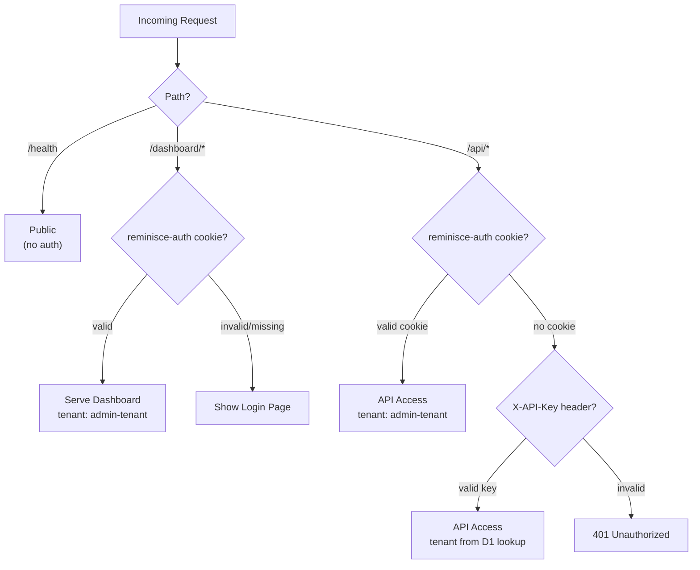

### PIN Cookie Auth (Dashboard)

- **Cookie name:** `reminisce-auth`
- **Max age:** 30 days
- **Domain:** Your worker domain
- **Login endpoint:** `POST /__auth` with `pin` form field
- **Tenant mapping:** PIN auth maps to the `ADMIN_TENANT` env var (set in `wrangler.toml`)

### API Key Auth (Programmatic)

- **Header:** `X-API-Key`
- **Machine ID:** `X-Machine-ID` (optional, for tracking)
- **Lookup:** D1 `tenants` table, filtered by `api_key` and `active = 1`
- **Format:** `reminisce_{machine}_{hex}`

---

## Cloud API Reference

Base URL: `https://your-worker.your-domain.com`

All `/api/*` endpoints require authentication via `X-API-Key` header or PIN cookie.

### Write Endpoints

#### `POST /api/memory/episode`

Write an episodic memory. Auto-indexes into Vectorize.

```bash
curl -X POST -H "X-API-Key: $KEY" -H "Content-Type: application/json" \
  -d '{
    "event": "reminisce: Deployed cloud migration",
    "summary": "Migrated 251 records to D1 + Vectorize",
    "entities": ["reminisce", "cloudflare"],
    "valence": 0.7,
    "tags": ["deployment", "completed"],
    "session_id": "session-123",
    "started_at": "2026-02-03T00:00:00Z",
    "memory_id": {
      "id": "uuid-here",
      "layer": "episodic",
      "session": "session-123",
      "machine": "my-desktop",
      "created_at": "2026-02-03T00:00:00Z"
    },
    "provenance": {
      "source": "capture-hook",
      "confidence": 0.7,
      "retracted": false,
      "last_validated": "2026-02-03T00:00:00Z"
    },
    "salience": {
      "signals": { "novelty": 0.6, "goal": 0.7, "last_accessed": "2026-02-03T00:00:00Z" },
      "current_score": 0.7,
      "instrumentation": { "computed_at": "2026-02-03T00:00:00Z" }
    }
  }' \
  https://your-worker.your-domain.com/api/memory/episode
```

The Worker reshapes the flat body into the `@reminisce/core` `EpisodicMemory` structure (nested `content: { event, summary, entities, valence }`) before D1 storage.

#### `POST /api/memory/fact`

Write a semantic memory (fact). Auto-indexes into Vectorize.

```bash
curl -X POST -H "X-API-Key: $KEY" -H "Content-Type: application/json" \
  -d '{
    "fact": "User prefers bun over npm for all JS/TS projects",
    "subject": "user",
    "predicate": "prefers",
    "object": "bun",
    "category": "preferences",
    "tags": ["tooling", "preferences"],
    "memory_id": {
      "id": "uuid-here",
      "layer": "semantic",
      "session": "session-123",
      "machine": "my-desktop",
      "created_at": "2026-02-03T00:00:00Z"
    },
    "provenance": { "confidence": 0.8, "retracted": false, "last_validated": "2026-02-03T00:00:00Z" },
    "salience": {
      "signals": { "novelty": 0.5, "goal": 0.5, "last_accessed": "2026-02-03T00:00:00Z" },
      "current_score": 0.8,
      "instrumentation": { "computed_at": "2026-02-03T00:00:00Z" }
    }
  }' \
  https://your-worker.your-domain.com/api/memory/fact
```

#### `POST /api/embed`

Generate embeddings via Workers AI. Used as a fallback by the hook when LM Studio is down.

```bash
# Single text
curl -X POST -H "X-API-Key: $KEY" -H "Content-Type: application/json" \
  -d '{"text": "some text to embed"}' \
  https://your-worker.your-domain.com/api/embed

# Batch
curl -X POST -H "X-API-Key: $KEY" -H "Content-Type: application/json" \
  -d '{"text": ["text1", "text2"]}' \
  https://your-worker.your-domain.com/api/embed
```

**Response (single):**
```json
{
  "embedding": [0.123, -0.456, ...],
  "dimensions": 768,
  "model": "@cf/google/embeddinggemma-300m"
}
```

**Response (batch):**
```json
{
  "embeddings": [[...], [...]],
  "dimensions": 768,
  "model": "@cf/google/embeddinggemma-300m"
}
```

#### `POST /api/reindex`

Batch re-index all D1 records into Vectorize. Reads all episodes and facts, generates embeddings via Workers AI, and upserts into Vectorize.

```bash
curl -X POST -H "X-API-Key: $KEY" \
  "https://your-worker.your-domain.com/api/reindex?batch=10"
```

**Response:**
```json
{
  "success": true,
  "indexed": 140,
  "failed": 0,
  "total": { "episodes": 42, "facts": 98 }
}
```

The `batch` query parameter controls how many records are embedded per Workers AI call (default: 20).

#### `POST /api/chat`

RAG-powered chat. Retrieves relevant memories via Vectorize, then generates a response using Workers AI (Llama 2 7B).

```bash
curl -X POST -H "X-API-Key: $KEY" -H "Content-Type: application/json" \
  -d '{"question": "What do I prefer for package management?"}' \
  https://your-worker.your-domain.com/api/chat
```

#### `POST /api/init`

Initialize D1 schema (run once on first deploy). Requires API key authentication.

```bash
curl -X POST -H "X-API-Key: $KEY" https://your-worker.your-domain.com/api/init
```

### Read Endpoints

#### `GET /api/search`

Unified vector search across episodic and semantic memories. Generates a query embedding via Workers AI, searches Vectorize, then hydrates full records from D1.

```bash
curl -H "X-API-Key: $KEY" \
  "https://your-worker.your-domain.com/api/search?q=photo+archive&limit=5"
```

**Query parameters:**

| Param | Type | Default | Description |
|-------|------|---------|-------------|
| `q` | string | (required) | Search query text |
| `limit` | number | 10 | Max results |
| `type` | string | (both) | Filter: `"episodic"` or `"semantic"` |

**Response:**
```json
{
  "results": [
    {
      "id": "abc-123",
      "score": 0.550,
      "memoryType": "semantic",
      "record": {
        "memory_id": { "id": "abc-123", "layer": "semantic", ... },
        "content": { "fact": "Created PHOTO-ARCHIVE at /Volumes/ARCHIVE/...", "subject": "photo-archive", ... },
        "provenance": { ... },
        "salience": { ... }
      }
    }
  ],
  "method": "vector"
}
```

Falls back to returning recent D1 records (`method: "fallback"`) if Vectorize is unavailable.

#### `GET /api/vector/search`

Direct Vectorize search (no D1 hydration). Returns vector IDs, scores, and metadata only.

```bash
curl -H "X-API-Key: $KEY" \
  "https://your-worker.your-domain.com/api/vector/search?q=cloudflare+deployment&topK=5&type=semantic"
```

| Param | Type | Default | Description |
|-------|------|---------|-------------|
| `q` | string | (required) | Search query text |
| `topK` | number | 10 | Max results |
| `type` | string | (both) | Filter: `"episodic"` or `"semantic"` |

#### `GET /api/stats`

System statistics for the current tenant.

```bash
curl -H "X-API-Key: $KEY" https://your-worker.your-domain.com/api/stats
```

**Response:**
```json
{
  "workingMemorySize": 0,
  "workingMemoryCapacity": 7,
  "pendingEpisodes": 42,
  "consolidatedEpisodes": 0,
  "totalFacts": 98,
  "sessions": 15,
  "episodic": { "count": 42 },
  "semantic": { "count": 98 }
}
```

Returns both flat fields (for dashboard compatibility) and nested fields (for API consumers).

#### `GET /api/memory/episodic`

Query episodic memories from D1.

| Param | Type | Default | Description |
|-------|------|---------|-------------|
| `limit` | number | 50 | Max results |
| `sessionId` | string | (all) | Filter by session ID |

#### `GET /api/memory/semantic`

Query semantic memories from D1.

| Param | Type | Default | Description |
|-------|------|---------|-------------|
| `limit` | number | 50 | Max results |
| `subject` | string | (all) | Filter by subject |
| `category` | string | (all) | Filter by category |

#### `GET /api/memory/working`

Returns empty array. Working memory is session-local (volatile, in-memory) and not persisted to the cloud.

```json
{ "items": [], "note": "Working memory is session-local and not persisted to the cloud." }
```

#### `GET /api/graph`

Knowledge graph derived from semantic SPO triples. Builds nodes (subjects, objects, facts) and edges (predicates) from up to 500 semantic memories.

**Response:**
```json
{
  "nodes": [
    { "id": "s:user", "label": "user", "type": "subject" },
    { "id": "o:bun", "label": "bun", "type": "object" }
  ],
  "edges": [
    { "from": "s:user", "to": "o:bun", "label": "prefers", "type": "prefers" }
  ]
}
```

Node types: `"subject"`, `"object"`, `"fact"` (for facts without explicit objects).

#### `GET /api/tenant`

Get current authenticated tenant info.

```json
{
  "tenantId": "my-desktop",
  "tenantName": "My Desktop",
  "machineId": "dashboard",
  "authenticated": true
}
```

### Delete Endpoints

| Method | Path | Description |
|--------|------|-------------|
| `DELETE` | `/api/memory/episodic/:id` | Delete a single episodic memory |
| `DELETE` | `/api/memory/semantic/:id` | Delete a single semantic memory |
| `DELETE` | `/api/session/:sessionId` | GDPR: delete all data for a session (both episodic and semantic) |

### Health Check

`GET /health` — No auth required.

```json
{
  "status": "ok",
  "timestamp": "2026-02-04T12:00:00Z",
  "features": {
    "d1": true,
    "vectorize": true,
    "workersAi": true
  }
}
```

### Complete Endpoint Summary

| Method | Path | Auth | Description |
|--------|------|------|-------------|
| `GET` | `/health` | No | Health check with feature flags |
| `POST` | `/api/init` | Yes | Initialize D1 schema |
| `GET` | `/api/stats` | Yes | System statistics |
| `GET` | `/api/memory/working` | Yes | Working memory (always empty) |
| `GET` | `/api/memory/episodic` | Yes | Query episodic memories |
| `GET` | `/api/memory/semantic` | Yes | Query semantic memories |
| `POST` | `/api/memory/episode` | Yes | Write episodic + auto-vectorize |
| `POST` | `/api/memory/fact` | Yes | Write semantic + auto-vectorize |
| `DELETE` | `/api/memory/episodic/:id` | Yes | Delete episodic memory |
| `DELETE` | `/api/memory/semantic/:id` | Yes | Delete semantic memory |
| `DELETE` | `/api/session/:sessionId` | Yes | GDPR session delete |
| `GET` | `/api/search` | Yes | Unified vector search + D1 hydration |
| `GET` | `/api/vector/search` | Yes | Direct Vectorize search |
| `POST` | `/api/embed` | Yes | Generate embeddings (single/batch) |
| `POST` | `/api/reindex` | Yes | Batch re-index D1 into Vectorize |
| `POST` | `/api/chat` | Yes | RAG-powered chat |
| `GET` | `/api/graph` | Yes | Knowledge graph from SPO triples |
| `GET` | `/api/tenant` | Yes | Current tenant info |
| `GET` | `/dashboard/*` | PIN | Web dashboard SPA |
| `POST` | `/__auth` | No | PIN login form submission |

---

## Dashboard

The web dashboard is a React SPA (built with Vite) served from the Worker's static assets.

**URL:** `https://your-worker.your-domain.com/dashboard/`

### Views

| View | Description | API Endpoint |
|------|-------------|--------------|
| **Stats Overview** | Episode count, fact count, session count, working memory | `GET /api/stats` |
| **Episodic Timeline** | Chronological list of session episodes with entities and valence | `GET /api/memory/episodic` |
| **Semantic Facts Browser** | Facts grouped by subject with contradiction detection | `GET /api/memory/semantic?limit=1000` |
| **Knowledge Graph** | Interactive node-edge visualization of SPO triples | `GET /api/graph` |
| **Working Memory** | Shows in-memory buffer status (empty in cloud context) | `GET /api/memory/working` |

### Building and Deploying the Dashboard

```bash
# Build dashboard → copy to Worker's public directory → build Worker → deploy
cd packages/cloudflare
bun run deploy  # runs build:dashboard + build + wrangler deploy
```

The dashboard build pipeline:
1. `packages/dashboard/` — Vite + React source
2. `bun run build:dashboard` — builds dashboard, copies `dist/*` to `packages/cloudflare/public/dashboard/`
3. Wrangler's `[assets]` config serves `public/` as static assets with `run_worker_first = true`
4. Worker PIN auth middleware protects `/dashboard/*` routes before assets are served

### Dashboard Authentication

The dashboard uses PIN cookie auth. On first visit, users see a login page. After entering the correct PIN, a 30-day `reminisce-auth` cookie is set. The dashboard then makes API calls with this cookie. The Worker maps PIN-authenticated requests to the tenant specified by the `ADMIN_TENANT` environment variable.

---

## Memory Router Integration

Reminisce can be integrated with a memory-router or any MCP client that aggregates multiple memory backends.

### Search Flow

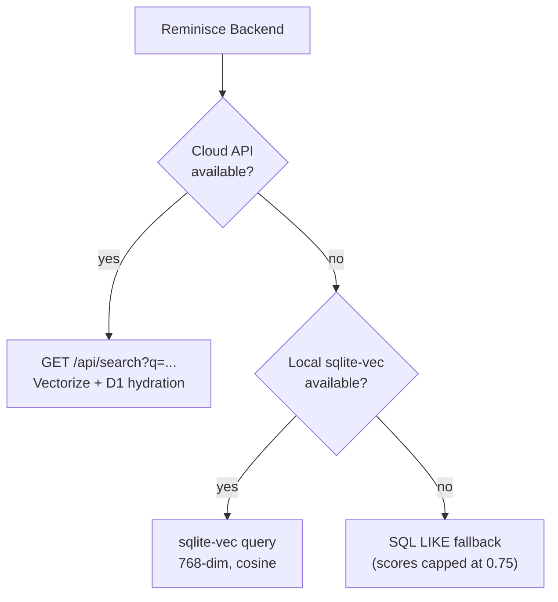

### Three-Tier Search Strategy

Reminisce uses a three-tier fallback search strategy:

1. **Cloud API (primary):** `GET https://your-worker.your-domain.com/api/search?q=...` - Vectorize for semantic similarity, returns scored results with full D1 records
2. **Local vector search (fallback 1):** sqlite-vec query against `~/.reminisce/memory.db` - uses LM Studio for query embedding
3. **Local LIKE search (fallback 2):** SQL LIKE queries against episodic + semantic tables - no embeddings needed, lower relevance scores

### Cloud API Configuration

```json
{
  "env": {
    "REMINISCE_API_URL": "https://your-worker.your-domain.com",
    "REMINISCE_API_KEY": "your-api-key-here"
  }
}
```

Without these, the local SQLite fallback is used.

### How Reminisce Fits in a Multi-Backend Memory System

Reminisce is designed to slot into a unified memory system alongside other backends:

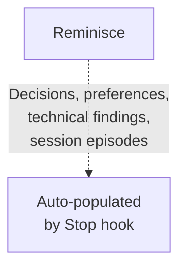

Reminisce captures **structured knowledge** - what was decided, what broke, what users prefer - in a format optimized for vector search.

---

## Cognitive Memory Architecture

Reminisce is built on findings from cognitive science research, specifically the **Complementary Learning Systems (CLS) theory** ([McClelland, McNaughton & O'Reilly, 1995](https://pubmed.ncbi.nlm.nih.gov/7624455/)).

### The Three-Layer Model

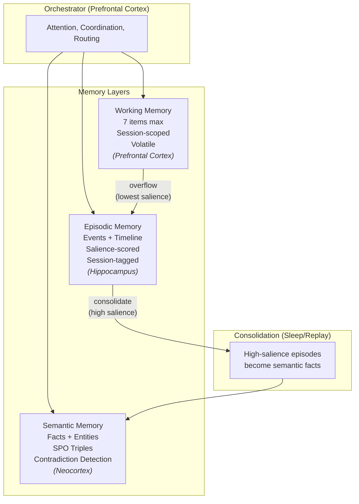

### Working Memory: The 7-Item Limit

Based on **Miller's Law** and **Baddeley's Working Memory Model**, working memory is intentionally constrained:

- **Capacity**: 7 items (configurable, based on human working memory limits)
- **Scope**: Single session
- **Persistence**: In-memory only (volatile)
- **Overflow**: When capacity exceeded, lowest-salience items automatically flow to episodic memory
- **Cloud note**: Working memory lives in the local MCP server's process; the cloud Worker has no persistent working memory

### Episodic Memory: What Happened When

Episodic memory stores **events with temporal context**:

- **Time-indexed**: Every episode has a timestamp
- **Session-tagged**: Episodes belong to sessions
- **Entity-aware**: Tracks entities involved in each event
- **Salience-scored**: Important events score higher
- **Consolidation candidates**: High-salience episodes become semantic facts

### Semantic Memory: Facts and Knowledge

Semantic memory stores **distilled facts** extracted from episodes:

- **Subject-Predicate-Object triples**: Structured knowledge representation
- **Provenance tracking**: Every fact links to source episodes
- **Confidence scoring**: Facts have confidence levels that decay over time
- **Contradiction detection**: New facts are checked against existing knowledge
- **Soft delete**: Facts are "retracted" with reasons, not hard deleted

### Consolidation: The Sleep Analog

Inspired by **Sharp Wave Ripples (SPW-Rs)** during sleep, consolidation transforms episodic experiences into semantic knowledge:

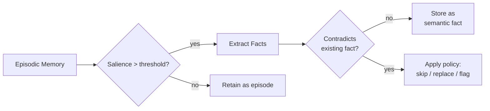

---

## MCP Tools Reference

Reminisce exposes 8 tools via the Model Context Protocol (MCP) through the `@reminisce/mcp-server` package.

### remember

Add an item to working memory. Items overflow to episodic memory when capacity (7) is exceeded.

| Parameter | Type | Required | Description |
|-----------|------|----------|-------------|
| `type` | `'message' \| 'tool_result' \| 'context' \| 'goal'` | Yes | Type of memory item |
| `data` | `unknown` | Yes | The data to remember |
| `summary` | `string` | No | Brief summary of the item |
| `tags` | `string[]` | No | Tags for categorization |
| `signals` | `object` | No | Salience signals |

### search

Search across working, episodic, and semantic memory layers. When `REMINISCE_VECTOR=true` and LM Studio is available, semantic search is augmented with vector similarity - the query text is embedded and matched against stored fact embeddings via sqlite-vec, then merged with LIKE results for better coverage. Falls back to LIKE-only if LM Studio is unavailable.

Semantic results include a `relevance` field: vector cosine similarity (0-1) when vector search is active, or `0.1` as a low-confidence fallback for LIKE-only matches. Results are sorted by `relevance` descending.

| Parameter | Type | Required | Description |
|-----------|------|----------|-------------|
| `text` | `string` | No | Text to search for (uses LIKE + vector similarity) |
| `tags` | `string[]` | No | Filter by tags |
| `sessionId` | `string` | No | Filter by session ID |
| `limit` | `number` | No | Max results per layer (default: 10) |

### store_fact

Store a fact directly in semantic memory. When `REMINISCE_VECTOR=true` and LM Studio is available, the fact is automatically embedded (composite of subject + predicate + object + fact) and indexed in sqlite-vec for vector search. The response includes a `vectorIndexed` field indicating whether embedding succeeded.

| Parameter | Type | Required | Description |
|-----------|------|----------|-------------|
| `fact` | `string` | Yes | The fact to store |
| `subject` | `string` | No | Subject (for SPO triple) |
| `predicate` | `string` | No | Predicate/relationship |
| `object` | `string` | No | Object of the fact |
| `category` | `string` | No | Category |
| `confidence` | `number` | No | Confidence 0-1 (default: 0.9) |
| `tags` | `string[]` | No | Tags |

### record_episode

Record an episode directly to episodic memory.

| Parameter | Type | Required | Description |
|-----------|------|----------|-------------|
| `event` | `string` | Yes | Event type/name |
| `summary` | `string` | Yes | Summary of what happened |
| `entities` | `string[]` | No | Entities involved |
| `tags` | `string[]` | No | Tags |
| `valence` | `number` | No | Emotional valence (-1 to 1) |

### get_facts

Get all known facts about a subject.

| Parameter | Type | Required | Description |
|-----------|------|----------|-------------|
| `subject` | `string` | Yes | Subject to query |

### consolidate

Manually trigger consolidation of episodic memories into semantic facts. No parameters.

### get_stats

Get system statistics across all memory layers. No parameters.

### forget_session

Delete all memories for a session (GDPR compliance).

| Parameter | Type | Required | Description |
|-----------|------|----------|-------------|
| `sessionId` | `string` | Yes | Session ID to forget |

### MCP Resources

| URI | Description |
|-----|-------------|
| `reminisce://working/current` | Current working memory contents |
| `reminisce://episodes/recent` | Recent episodic memories (last 20) |
| `reminisce://facts/{subject}` | Facts about a specific subject |

---

## Memory Model

### Salience Computation

Every memory item receives a salience score computed from weighted signals:

```typescript
const DEFAULT_WEIGHTS = {
  reward: 0.25,      // Positive outcomes
  error: 0.20,       // Errors are memorable
  novelty: 0.15,     // New information
  emotion: 0.15,     // Emotional intensity
  access: 0.10,      // Retrieval reinforcement
  goal: 0.10,        // Goal relevance
  user_pin: 0.05,    // Explicit importance
};

// Final score = weighted sum, clamped to [0, 1]
// Pinned items get +0.3 bonus
// Blocked items get score of -1 (removed)
```

### Salience JSON Structure (stored in D1)

```json
{
  "signals": {
    "reward_signal": 0,
    "error_signal": 0,
    "user_pinned": false,
    "user_blocked": false,
    "novelty_score": 0.5,
    "emotional_intensity": 0,
    "access_count": 0,
    "last_accessed": "2026-02-03T00:00:00Z",
    "goal_relevance": 0
  },
  "current_score": 0.7,
  "instrumentation": {
    "computed_at": "2026-02-03T00:00:00Z",
    "raw_signals": {},
    "weighted_contributions": {},
    "final_score": 0.7
  }
}
```

### Provenance Chain

Every semantic fact maintains a provenance chain:

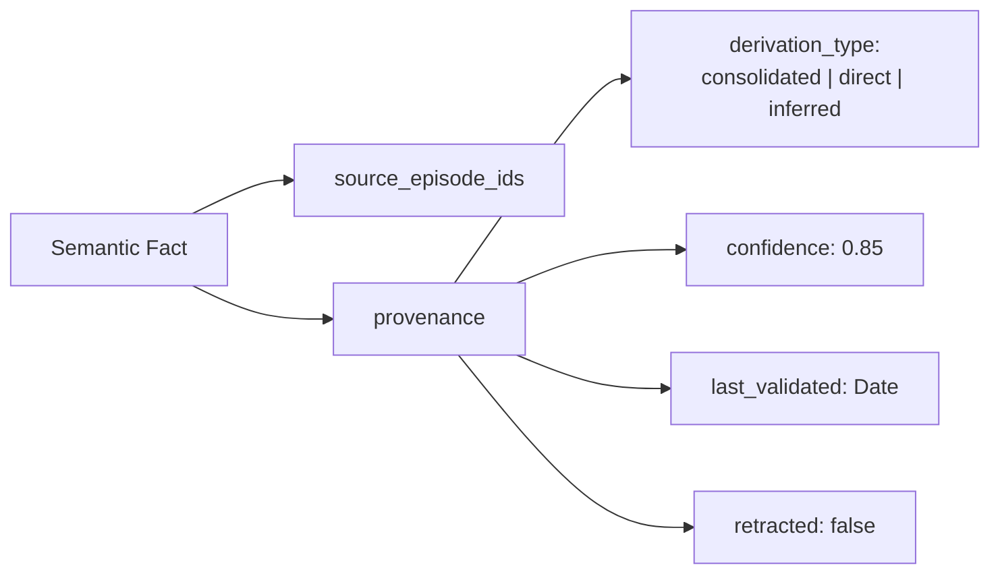

### Provenance JSON Structure (stored in D1)

```json
{
  "source_ids": [],
  "derivation_type": "direct",
  "confidence": 0.8,
  "last_validated": "2026-02-03T00:00:00Z",
  "contradiction_ids": [],
  "retracted": false
}
```

### Contradiction Handling

When storing a new fact, the system checks for contradictions against existing knowledge with the same subject-predicate pair. Policies: `skip`, `replace`, or `manual_flag`.

The dashboard's Semantic Facts Browser has built-in contradiction detection — it compares facts sharing the same subject and predicate, flagging groups with differing objects. Multi-valued predicates (like `has_preference`, `uses_tool`) are excluded from contradiction checks.

---

## Data Quality Pipeline

The Stop hook includes three layers of data quality filtering to prevent garbage and duplicate facts.

### 1. Context Tag Stripping

Before regex-based fact extraction runs, the hook strips injected system context from user text:

```
Stripped tags:
  <system-reminder>...</system-reminder>
  <context-enforcement>...</context-enforcement>
  <past-context>...</past-context>
  <reminisce-patterns>...</reminisce-patterns>
  <agent-status>...</agent-status>
```

Without this, regex patterns would match against CLAUDE.md instructions and system-reminder injections, producing garbage like "HTML tags for basic content" extracted from the CLAUDE.md rule "Markdown > HTML."

### 2. Garbage Pattern Filter

Extracted facts are checked against known garbage patterns:

| Pattern | What It Catches |
|---------|----------------|
| `[{}'";\\]` | Code/JSON artifacts |
| `^\s*it[\s"]` | Dangling pronoun "it" |
| `^\s*that\s` | Dangling "that project" |
| `^\s*this\s` | Dangling "this" |
| `\?\s*["=]` | UI prompt fragments |
| `^[a-z]{1,4}\s*$` | Single tiny words |
| `C:\\|\/opt\/` | File paths |
| `sent while` | Debug log fragments |
| `check if.*needed` | Conversational fragments |

### 3. Cloud Deduplication

Before storing a fact, the hook queries the cloud API for existing facts with the same subject, then checks for matching predicate + object:

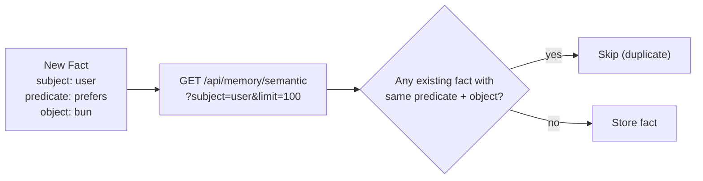

---

## Packages

| Package | Description | Status |
|---------|-------------|--------|
| `@reminisce/core` | Shared types, salience engine, provenance | Complete |
| `@reminisce/working` | Working memory (7-item buffer) | Complete |
| `@reminisce/episodic` | Episodic memory (timeline storage) | Complete |
| `@reminisce/semantic` | Semantic memory (facts, contradiction detection) | Complete |
| `@reminisce/consolidation` | Episodic-to-semantic extraction | Complete |
| `@reminisce/orchestrator` | Unified interface across all layers | Complete |
| `@reminisce/api` | Shared API utilities (auth middleware, types) | Complete |
| `@reminisce/mcp-server` | MCP server wrapper (local) | Complete |
| `@reminisce/storage-sqlite` | SQLite persistent storage (local) | Complete |
| `@reminisce/cloudflare` | Cloudflare Workers deployment (cloud) | Complete |

### Package Dependency Graph

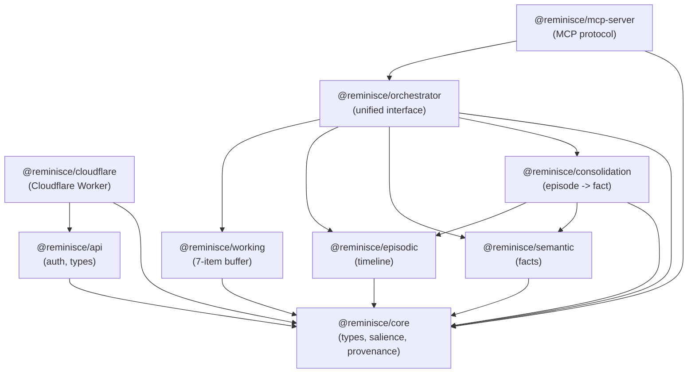

### Key Source Files

| File | Description |
|------|-------------|
| `packages/cloudflare/src/worker.ts` | Main Worker entry: Hono router, all API endpoints, auth middleware |
| `packages/cloudflare/src/d1-storage.ts` | D1 storage adapters (CRUD for episodic + semantic), schema definition |
| `packages/cloudflare/src/vectorize.ts` | Vectorize integration: `VectorStore`, `WorkersAIEmbeddings`, `RAGHelper` |
| `packages/cloudflare/wrangler.toml.example` | Cloudflare bindings template (copy to `wrangler.toml` and fill in your values) |
| `packages/dashboard/src/` | React dashboard SPA (Vite, TypeScript, Tailwind) |
| `packages/mcp-server/src/index.ts` | Local MCP server entry point |
| `packages/core/src/types.ts` | Core type definitions (`MemoryID`, `EpisodicMemory`, `SemanticMemory`, etc.) |

---

## Configuration

### Environment Variables

#### Local MCP Server

| Variable | Description | Default |
|----------|-------------|---------|
| `REMINISCE_DB_PATH` | SQLite database path | `~/.reminisce/memory.db` |
| `REMINISCE_MACHINE_ID` | Machine identifier | `reminisce-mcp` |
| `REMINISCE_VECTOR` | Enable sqlite-vec vector search | `false` |
| `REMINISCE_DIMENSIONS` | Embedding dimensions | `768` |
| `REMINISCE_EMBED_URL` | LM Studio base URL for embeddings | `http://localhost:1234` |
| `REMINISCE_EMBED_MODEL` | Embedding model name | `text-embedding-embeddinggemma-300m` |

#### Cloud (Hook / Memory-Router)

| Variable | Description | Default |
|----------|-------------|---------|
| `REMINISCE_API_URL` | Cloud Worker URL | (none - required for cloud mode) |
| `REMINISCE_API_KEY` | API key for cloud auth | (none) |

#### Cloud Worker (wrangler.toml / secrets)

| Binding/Secret | Type | Description |
|----------------|------|-------------|
| `DB` | D1 binding | D1 database (`reminisce-memory`) |
| `VECTORIZE` | Vectorize binding | Vector index (`reminisce-vectors`) |
| `AI` | Workers AI binding | Embedding generation |
| `ASSETS` | Static assets | Dashboard SPA files |
| `AUTH_PIN` | Secret | Dashboard PIN (set via `wrangler secret put`) |
| `CORS_ORIGINS` | Var | CORS allowed origins (default: `"*"`) |
| `ALLOW_ANONYMOUS` | Var | Unauthenticated access (default: `"false"`) |
| `JWT_SECRET` | Secret (optional) | JWT authentication secret |

### MCP Server Config

Add to your MCP client configuration (e.g., `~/.mcp.json` for Claude Desktop, or `~/.claude/mcp.json` for Claude Code):

```json
{
  "reminisce": {
    "command": "bun",
    "args": ["run", "/path/to/reminisce/packages/mcp-server/dist/index.js"],
    "env": {
      "REMINISCE_DB_PATH": "~/.reminisce/memory.db",
      "REMINISCE_MACHINE_ID": "my-machine",
      "REMINISCE_VECTOR": "true",
      "REMINISCE_DIMENSIONS": "768",
      "REMINISCE_EMBED_URL": "http://localhost:1234",
      "REMINISCE_EMBED_MODEL": "text-embedding-embeddinggemma-300m"
    }
  }
}
```

---

## Development

### Quick Start

```bash
# Install dependencies
bun install

# Run all tests
bun test

# Run tests for a specific package
bun test --filter @reminisce/core
bun test --filter @reminisce/working

# Build all packages
bun run build

# Type check
bun run lint
```

### Cloudflare Worker Development

```bash
cd packages/cloudflare

# Local dev server (uses wrangler dev)
bun run dev

# Build dashboard + Worker + deploy
bun run deploy

# Build steps individually:
bun run build:dashboard  # Build React dashboard, copy to public/dashboard/
bun run build            # TypeScript compile Worker
npx wrangler deploy      # Deploy to Cloudflare
```

### Data Migration

To migrate local SQLite records to the cloud, write a script that reads from your local `~/.reminisce/memory.db` and posts to `POST /api/memory/episode` and `POST /api/memory/fact`. After migration, re-index Vectorize:

```bash
curl -X POST -H "X-API-Key: $KEY" \
  "https://your-worker.your-domain.com/api/reindex?batch=10"
```

### Managing Vectorize

```bash
# Check index info
npx wrangler vectorize info reminisce-vectors

# List all indexes
npx wrangler vectorize list

# Create metadata indexes (required for filtering)
npx wrangler vectorize create-metadata-index reminisce-vectors --property-name=tenant_id --type=string
npx wrangler vectorize create-metadata-index reminisce-vectors --property-name=memory_type --type=string
```

### Managing D1

```bash
# Execute SQL queries
npx wrangler d1 execute reminisce-memory --command "SELECT COUNT(*) FROM episodic_memories"

# Export data
npx wrangler d1 export reminisce-memory --output backup.sql
```

---

## Troubleshooting

### Cloud Issues

**Vector search returning empty results**

Vectorize processes upserts asynchronously. After writing records or running a reindex, wait 30-60 seconds for the mutation queue to process, then retry. Check progress:

```bash
npx wrangler vectorize info reminisce-vectors
```

**POST endpoints returning 500**

The Worker reshapes flat API bodies into nested `@reminisce/core` types (`content: { event, summary }` for episodes, `content: { fact, subject }` for facts). If the body structure is wrong, the D1 store will throw. Check that required fields are present.

**Dashboard showing zeros for stats**

Ensure the `ADMIN_TENANT` environment variable in `wrangler.toml` matches the tenant ID where your data is stored. Check `worker.ts` PIN auth section.

**Dashboard showing limited subjects in Semantic Facts Browser**

The browser fetches up to 1000 facts and groups client-side. If you have more than 1000 facts, not all subjects will appear. Increase the limit in `SemanticBrowser.tsx`.

**Metadata filter returning 0 results**

Vectorize V2 requires explicit metadata indexes before filtering works. Create them:

```bash
npx wrangler vectorize create-metadata-index reminisce-vectors --property-name=tenant_id --type=string
npx wrangler vectorize create-metadata-index reminisce-vectors --property-name=memory_type --type=string
```

### Local Issues

**Vector search not working on macOS**

sqlite-vec requires Homebrew SQLite with extension support:

```bash
brew install sqlite
```

The MCP server auto-detects the Homebrew SQLite path.

**Database locked errors**

WAL mode is enabled by default. Ensure only one process writes to the database at a time.

**Hook not capturing sessions**

1. Check hook registration in your MCP client config under `hooks.Stop`
2. The hook skips sessions with fewer than 3 user messages and no file changes (quality gate)
3. Check that `REMINISCE_API_KEY` is set in the hook's environment for cloud writes
4. Run the hook manually with a test transcript to verify extraction

**Duplicate facts appearing**

The cloud dedup check queries existing facts by subject before storing. If the cloud API is unreachable during the check, the fact may be stored without dedup. Run a cleanup query against D1:

```sql
-- Find duplicates
SELECT subject, predicate, object, COUNT(*) as dupes
FROM semantic_memories
GROUP BY subject, predicate, object
HAVING dupes > 1;
```

---

## License

MIT

---

Built with insights from cognitive science and neuroscience research on human memory systems.
