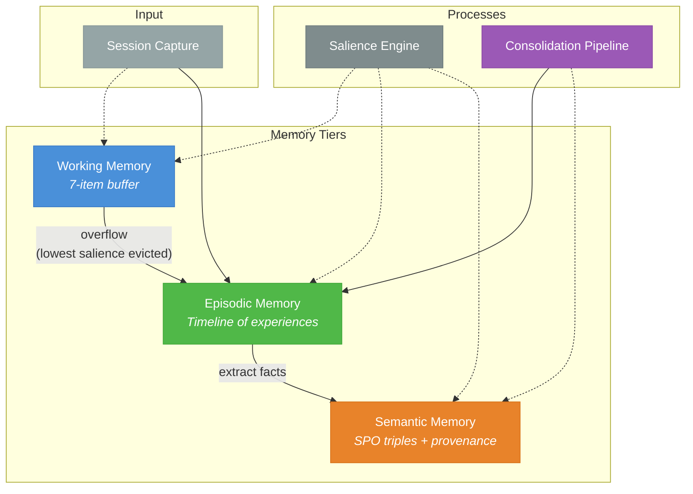

# Reminisce: A Cognitive Science-Inspired Memory Architecture for AI Agents

**Myron Koch -** Independent Researcher - [github.com/MyronKoch/reminisce](https://github.com/MyronKoch/reminisce)

*March 2026*

---

## Abstract

Long-term memory systems for AI agents predominantly optimize for verbatim retrieval -- storing and retrieving conversation turns with maximum fidelity. Human memory, by contrast, operates through a fundamentally different mechanism: experiences are compressed into episodes, episodes consolidate into semantic knowledge, and salience determines what is retained versus forgotten. We present **Reminisce**, an open-source memory architecture that models this cognitive pipeline through three distinct tiers: working memory (bounded capacity buffer), episodic memory (timeline of experiences), and semantic memory (consolidated knowledge with contradiction detection). Reminisce implements salience-based eviction, mandatory provenance tracking, and an automatic consolidation pipeline that transforms episodic experiences into semantic facts. We evaluate on LongMemEvalS (500 questions across 6 question types) using three Claude model tiers and find that Reminisce achieves 98.3% precision on single-session user recall and up to 81.8% precision on attempted answers across model tiers, with only an 11.0% error rate for the best-precision configuration. We observe that model selection affects coverage but not precision -- the cheapest model (Haiku) matches the most capable (Opus) at \~81% precision while the mid-tier model (Sonnet) trades precision for coverage. Reminisce is released as open-source software with 606 tests across 10 packages.

---

## 1. Introduction

Memory is a fundamental requirement for AI agents that operate across multiple sessions. Without persistent memory, every interaction starts from zero -- context is lost, preferences are forgotten, and learned knowledge evaporates. The dominant approach to this problem is retrieval-augmented generation (RAG): store conversation turns in a vector database, retrieve the most similar passages at query time (Karpukhin et al., 2020), and inject them into the language model's context window (Lewis et al., 2020).

This approach optimizes for a specific objective: maximizing the probability of recalling any piece of information from the conversation history. Systems like MemGPT (Packer et al., 2023), Chronos (Sen et al., 2026), and commercial offerings like Zep achieve impressive recall rates on benchmarks such as LongMemEvalS (Wu et al., 2024).

However, human memory does not work this way. The Atkinson-Shiffrin model (Atkinson & Shiffrin, 1968) describes memory as a multi-stage process: sensory input flows through short-term (working) memory, which has severely limited capacity, into long-term storage through rehearsal and encoding. Long-term memory itself divides into episodic memory (experiences and events) and semantic memory (general knowledge and facts) (Tulving, 1972). Crucially, human memory is lossy by design -- we forget most experiences, retaining only what is salient.

We present Reminisce, a memory architecture for AI agents that explicitly models this cognitive pipeline. Our contributions are:

- A **three-tier memory hierarchy** (working, episodic, semantic) with capacity-bounded working memory and salience-driven overflow
- **Automatic consolidation** that extracts semantic facts from episodic memories, mirroring the hippocampal-neocortical consolidation process
- **Salience scoring** with six weighted signals (reward, error, novelty, emotion, goal relevance, access frequency) that determines retention priority
- **Mandatory provenance** ensuring every fact traces to its source episodes, with support for retraction and contradiction detection
- **Evaluation on LongMemEvalS** using three Claude model tiers (Haiku, Sonnet, Opus), revealing that precision is architecture-dependent while coverage is model-dependent -- a separation not, to our knowledge, previously characterized in memory system evaluations
- **Open-source release** with 606 tests, dual cloud/local deployment, and an MCP server for AI assistant integration

---

## 2. Background and Motivation

### 2.1 The Atkinson-Shiffrin Model

The Atkinson-Shiffrin model (1968) describes human memory as three stores: a sensory register, a short-term store (working memory) with limited capacity, and a long-term store. Information flows from short-term to long-term through rehearsal, encoding, and consolidation. Miller's observation that working memory is limited to approximately 7 +/- 2 items (Miller, 1956) establishes a fundamental capacity constraint that Reminisce directly models.

### 2.2 Episodic and Semantic Memory

Tulving's distinction between episodic memory (autobiographical events anchored in time and place) and semantic memory (general world knowledge decoupled from specific experiences) (Tulving, 1972) is central to our design. In the brain, episodic memories formed in the hippocampus gradually consolidate into semantic knowledge stored in the neocortex -- a process that takes days to weeks. Reminisce implements an analogous pipeline where episodic memories (session transcripts) are processed by an extraction engine to produce semantic facts (subject-predicate-object triples).

### 2.3 Salience and Forgetting

Not all memories are created equal. The brain preferentially encodes and retains information that is emotionally significant, novel, or goal-relevant (McGaugh, 2004). Ebbinghaus's forgetting curve (1885) describes the decay of memory over time, modulated by factors like emotional intensity and rehearsal. Reminisce implements this through a salience engine that scores every memory item on six dimensions, producing a composite score that governs eviction priority, retrieval ranking, and consolidation thresholds.

---

## 3. System Architecture

Reminisce is organized as a monorepo of 10 TypeScript packages with clear dependency boundaries. The core architecture implements three memory tiers connected by a consolidation pipeline.

*Figure 1: Reminisce architecture overview. Input flows from session capture into working memory (bounded) and episodic memory (unbounded). The salience engine scores all items across tiers. The consolidation pipeline extracts semantic facts from episodes. Working memory overflow is governed by salience: the lowest-scored item is evicted to episodic storage.*

### 3.1 Working Memory

The working memory tier implements a bounded-capacity buffer with a hard limit of 7 items, directly modeling Miller's 7 +/- 2 constraint. When capacity is exceeded, the item with the lowest salience score is evicted to episodic memory. Items can be explicitly pinned to prevent eviction (analogous to attentional focus).

Each working memory item carries content (typed as message, tool result, context, or goal), salience signals (six dimensions, described in Section 3.4), and a slot position with creation timestamp.

### 3.2 Episodic Memory

Episodic memory stores timeline-ordered events tagged by session, with each episode containing an event description, summary, entity list, and emotional valence. This tier serves as the accumulation buffer for experiences before consolidation.

In production deployment, episodes are populated automatically by a Claude Code session hook that fires after every interaction, parsing the session transcript to extract a structured episode with entities and valence.

### 3.3 Semantic Memory

Semantic memory stores consolidated facts as subject-predicate-object (SPO) triples with associated metadata. Three key design decisions distinguish this tier:

**Contradiction detection.** Before storing a new fact, the system checks existing facts with matching subject and predicate. If a contradiction is found, the system records both facts with their respective confidence scores and source provenance, allowing downstream consumers to resolve conflicts.

**Soft deletes.** Facts are never hard-deleted. Instead, they are *retracted* with a reason and timestamp, preserving the audit trail. This models the observation that human memory does not truly delete -- we suppress rather than erase.

**Mandatory provenance.** Every semantic fact must reference at least one source episode. Orphan facts are architecturally impossible. This enables full traceability from any fact back to the experience that produced it.

### 3.4 Salience Engine

Every memory item is scored by a configurable salience engine with six signal dimensions, each grounded in a cognitive analog:

| Signal | Range | Cognitive Analog |
| --- | --- | --- |
| Reward signal | \[0, 1\] | Dopaminergic reinforcement |
| Error signal | \[0, 1\] | Prediction error / surprise |
| Novelty score | \[0, 1\] | Orienting response |
| Emotional intensity | \[0, 1\] | Amygdala modulation |
| Goal relevance | \[0, 1\] | Prefrontal executive attention |
| Access count | N | Rehearsal / retrieval practice |

*Table 1: Salience signal dimensions and their cognitive analogs.*

The composite salience score is a weighted sum of these signals, with weights configurable per deployment. The score governs three behaviors: working memory eviction (lowest score evicted first), consolidation priority (high-salience episodes consolidated first), and retrieval ranking.

### 3.5 Consolidation Pipeline

The consolidation pipeline transforms episodic memories into semantic facts through a configurable extraction engine. Two extraction modes are supported:

1. **Workers AI extraction** (cloud): Llama 3.1 8B processes episode content server-side via Cloudflare Workers AI, triggered automatically on episode ingestion with `ctx.waitUntil` for non-blocking execution
2. **LLM extraction** (on-demand): A higher-capability model (e.g., Claude) analyzes episodes for deeper fact extraction via a pluggable `FactExtractor` interface

Episodes are marked as consolidated after processing to prevent reprocessing. A daily cron trigger (Cloudflare Scheduled Events) catches any episodes missed by real-time extraction.

### 3.6 Dual Deployment

Reminisce supports two deployment modes with transparent failover:

**Cloud (primary):** Cloudflare Worker with D1 (SQLite-compatible) for storage, Vectorize for vector search, and Workers AI for embeddings (EmbeddingGemma-300m, 768 dimensions).

**Local (fallback):** SQLite with sqlite-vec for vector search, LM Studio for local embeddings. Used when the cloud endpoint is unreachable.

An MCP (Model Context Protocol) server exposes the full memory interface as 10 tools for integration with AI coding assistants, with vector-augmented search that merges keyword and cosine similarity results.

---

## 4. Evaluation

We evaluate Reminisce on LongMemEvalS (Wu et al., 2024), a benchmark of 500 questions across six question types testing long-term conversational memory. Each question provides a haystack of approximately 40-53 chat sessions (\~115K tokens) and tests whether the system can answer questions about information contained within those sessions.

### 4.1 Experimental Setup

For each of the 500 questions, we:

1. Create a fresh Reminisce instance (isolated per question)
2. Ingest all haystack sessions as episodic memories with rich summaries (up to 3,000 characters per session, preserving user and assistant content)
3. Retrieve relevant episodes using keyword-overlap ranking against the question text (top 15 episodes)
4. Generate a hypothesis answer using a Claude model with temperature 0

We test with three Claude model tiers to separate retrieval quality from answer generation capability:

- **Haiku 4.5** -- fastest, least capable (\~16s/question)
- **Sonnet 4.6** -- balanced (\~20s/question)
- **Opus 4.6** -- most capable (\~18s/question)

All three models receive identical retrieved context from the same retrieval pipeline. Answers are scored by Qwen3 80B as the primary LLM judge, comparing each hypothesis against the ground truth (correct answer need not be verbatim, but the core factual claim must match). All 1,500 judgments were cross-validated with an independent judge (Llama 3.3 70B via Groq), producing identical scores across every question.

Several methodological properties bear noting for reproducibility and result interpretation:

- **No tag leakage.** Episodes are ingested without question-category metadata. The retrieval and generation steps have no access to LongMemEval category labels, so category-level performance reflects genuine capability, not retrieval targeting.
- **Blind to answer availability.** The `has_answer` field from the LongMemEval dataset is not used during ingestion or retrieval. The model must decide whether to abstain purely from its own uncertainty.
- **Deterministic judging.** Temperature is set to 0 for the Qwen3 judge model to ensure fully reproducible scoring.
- **Evaluation retrieval vs. production retrieval.** The keyword-overlap retrieval used here differs from the production vector-augmented search path, which uses EmbeddingGemma-300m 768-dimensional embeddings via both sqlite-vec locally and Cloudflare Vectorize with Workers AI in the cloud. Evaluation results therefore represent a lower bound on retrieval quality achievable in the full system.

### 4.2 Results

**Table 2: LongMemEvalS results.** Precision = accuracy on attempted (non-abstained) answers. Error rate = proportion of all questions answered incorrectly. Reference systems always attempt an answer and do not report separate precision/error metrics. Note that reference systems' incorrect answers are distributed across the full question set, whereas Reminisce concentrates errors in a smaller attempted subset.

|  | Overall | Precision | Error Rate | Abstention |
| --- | --- | --- | --- | --- |
| Reminisce (Haiku 4.5) | 49.4% | **81.8%** | **11.0%** | 39.6% |
| Reminisce (Sonnet 4.6) | 52.8% | 74.2% | 18.4% | **28.8%** |
| Reminisce (Opus 4.6) | **55.8%** | 81.3% | 12.8% | 31.4% |
|  |  |  |  |  |
| *Chronos (Opus)* | *95.6%* | *--* | *--* | *--* |
| *Honcho* | *90.4%* | *--* | *--* | *--* |
| *Zep* | *71.2%* | *--* | *--* | *--* |

**Table 3: Per-category breakdown.** SSU = single-session user (n=70), SSA = single-session assistant (n=56), SSP = single-session preference (n=30; results should be interpreted with caution due to wide confidence intervals), MS = multi-session (n=133), KU = knowledge update (n=78), TR = temporal reasoning (n=133).

*Overall accuracy (%):*

|  | SSU | SSA | SSP | MS | KU | TR |
| --- | --- | --- | --- | --- | --- | --- |
| Haiku | 74.3 | 42.9 | 23.3 | 53.4 | 60.3 | 34.6 |
| Sonnet | 70.0 | 41.1 | 26.7 | 49.6 | **74.4** | **45.1** |
| Opus | **82.9** | **46.4** | **43.3** | **54.1** | 76.9 | 37.6 |

*Precision (%, accuracy on attempted answers):*

|  | SSU | SSA | SSP | MS | KU | TR |
| --- | --- | --- | --- | --- | --- | --- |
| Haiku | 96.3 | **96.0** | 77.8 | **76.3** | 70.1 | **85.2** |
| Sonnet | 84.5 | 76.7 | 66.7 | 62.3 | 79.5 | 77.9 |
| Opus | **98.3** | 89.7 | **92.9** | 70.6 | **84.5** | 73.5 |

*Abstention rate (%):*

|  | SSU | SSA | SSP | MS | KU | TR |
| --- | --- | --- | --- | --- | --- | --- |
| Haiku | 22.9 | 55.4 | 70.0 | 30.1 | 14.1 | 59.4 |
| Sonnet | 17.1 | 46.4 | 60.0 | 20.3 | **6.4** | **42.1** |
| Opus | **15.7** | **48.2** | **53.3** | **23.3** | 9.0 | 48.9 |

### 4.3 Analysis

**Near-perfect precision on direct recall.** Opus achieves 98.3% precision on single-session user recall (58/59 attempted answers correct). Haiku achieves 96.3% (52/54). When the retrieval tier surfaces the relevant episode, the answer generation is almost never wrong. This indicates that the episodic storage preserves sufficient detail for accurate recall even through summarization.

**Precision is architecture-dependent; coverage is model-dependent.** Haiku and Opus achieve nearly identical precision (\~81%) despite a significant capability gap. The difference between models manifests primarily in abstention rate: Opus abstains on 31.4% of questions versus Haiku's 39.6%. This separation suggests that the retrieval architecture determines answer quality, while the model determines how aggressively it attempts to answer from noisy context. To our knowledge, this precision-coverage separation has not been previously characterized in memory system evaluations.

**The *Sonnet anomaly*.** Sonnet 4.6 achieves the lowest abstention rate (28.8%) but also the lowest precision (74.2%) and highest error rate (18.4%). It is more willing than Opus to attempt answers from insufficient context, but at the cost of more errors. This *model personality* effect -- where a mid-tier model is more aggressive than a higher-tier model -- has implications for memory system deployment: the choice of answer-generation model affects the trust profile of the system independently of the memory architecture.

**Knowledge updates are a strength.** Reminisce scores 76.9% overall (Opus) on knowledge update questions -- among the strongest per-category scores and the category most aligned with the architecture's design. Contradiction detection and provenance tracking are first-class features that specifically support recognizing when information has changed across sessions.

**Errors vs. abstentions.** Reminisce's best-precision configuration (Haiku) produces 55 incorrect answers out of 500 questions (11.0%), while abstaining on 198 (39.6%). The system preferentially declines to answer rather than guessing from insufficient context. While recall-optimized systems achieve lower absolute error rates by answering more questions correctly, Reminisce's behavior makes errors explicit and predictable -- a property valuable in production deployments where silent incorrect answers erode trust.

---

## 5. Capabilities Beyond Recall

LongMemEvalS tests a specific capability: verbatim recall from conversation history. Reminisce provides several capabilities that this benchmark does not measure:

**Salience-based prioritization.** When memory grows large, not all items are equally important. The six-signal salience engine ensures that high-value memories are retained and surfaced preferentially, while low-value items are gracefully forgotten. This is architecturally enforced through the working memory capacity bound.

**Contradiction detection.** When new information contradicts existing knowledge (e.g., "I moved to Seattle" after previously storing "I live in Portland"), Reminisce detects the conflict via SPO triple matching and maintains both facts with provenance, enabling informed resolution.

**Knowledge consolidation.** The episodic-to-semantic pipeline mirrors the brain's consolidation process, producing structured facts from unstructured experiences. This enables queries like "what does the system know about X?" that operate on distilled knowledge rather than raw conversation logs.

**Mandatory provenance.** Every fact traces to its source episodes. Facts can be retracted (soft-deleted) with reasons. This audit trail is critical for trust and debugging in production deployments.

**Graceful degradation.** The dual-deployment architecture (cloud + local) ensures the system remains functional when network connectivity is interrupted, with automatic failover and later synchronization.

---

## 6. Related Work

**Surveys and taxonomies.** Hu et al. (2025) provide a comprehensive taxonomy of memory approaches for AI agents, categorizing systems along storage type, retrieval strategy, and temporal scope. Liang et al. (2025) bridge cognitive neuroscience and AI agent design, surveying the extent to which current systems reflect biological memory principles. While these surveys provide theoretical frameworks, Reminisce contributes a working implementation with empirical measurements across a standard benchmark.

**Production memory systems.** Chhikara et al. (2025) present Mem0, an entity-centric memory extraction system oriented toward production deployments; it focuses on identifying and updating named entities across conversation turns but does not implement a tier hierarchy or capacity bounds. Rasmussen et al. (2025) describe Zep/Graphiti, a temporal knowledge graph architecture that maintains validity windows on facts -- the closest structural analog to Reminisce's provenance and retraction model, but without working memory capacity limits or salience-driven eviction. LangMem (LangChain, no accompanying publication) borrows cognitive terminology but implements few-shot examples as "episodic" storage and prompt tuning as "procedural" memory, without a consolidation pipeline or capacity model. These systems optimize for retrieval fidelity; Reminisce prioritizes cognitive plausibility.

**Benchmark-optimized systems.** Several systems achieve state-of-the-art LongMemEvalS scores through retrieval engineering. Sen et al. (2026) (Chronos) build temporal event and turn calendars, reaching 95.6% overall accuracy. Honcho (Plastic Labs) takes an identity-centric approach, reaching 90.4%. Mastra Observational Memory applies an observer/reflector pattern and reports 94.87% with GPT-5-mini. EmergenceMem uses a deliberately minimal RAG approach. These systems achieve the highest LongMemEvalS scores through retrieval engineering. Reminisce takes a different approach, prioritizing knowledge organization over recall optimization.

**Cognitive architectures.** Anderson et al. (2004) (ACT-R) and Laird (2012) (SOAR) implement comprehensive cognitive models including declarative and procedural memory subsystems; Reminisce draws from this tradition but scopes to the memory component for practical deployment. Xu et al. (2025) present A-MEM, a Zettelkasten-inspired note-linking approach for LLM agents (NeurIPS 2025) that creates associative links between memories but does not implement a tier hierarchy with capacity bounds. The closest architectural competitor is Alqithami (2025) (MaRS), which implements episodic and semantic tiers with a consolidation step -- but lacks working memory capacity limits, a cloud deployment target, and multi-model empirical analysis. The Complementary Learning Systems theory (McClelland et al., 1995) provides the theoretical foundation for the episodic-to-semantic consolidation pipeline that both MaRS and Reminisce implement.

**Differentiation summary.** No prior system combines all four of these properties: three cognitive memory tiers with capacity-bounded working memory, a governed consolidation pipeline, a configurable multi-signal salience engine, and mandatory provenance tracking. Reminisce implements all four in a production-deployed system and provides empirical evaluation across multiple model tiers.

---

## 7. Discussion and Limitations

**Compression vs. recall tradeoff.** Reminisce's cognitive approach inherently trades recall for compression. By storing summaries rather than raw turns, the system loses specific details that recall-focused systems preserve. This is a principled design choice -- human memory makes the same tradeoff -- but it limits performance on verbatim recall benchmarks. The 98.3% precision on user recall demonstrates that the compression preserves sufficient detail for accurate answers when the relevant episode is found.

**Keyword retrieval limitations.** The current evaluation uses keyword-overlap ranking rather than full vector search. The MCP server supports vector-augmented search via sqlite-vec, and the cloud deployment uses Cloudflare Vectorize. Evaluating with vector retrieval we hypothesize would improve recall coverage significantly and reduce the abstention rate.

**Per-category sample size.** Per-category results for single-session preference (SSP, n=30) should be interpreted with caution due to limited sample size (95% CI ~+/-18pp). Categories with n>100 (multi-session, temporal reasoning) provide substantially more robust estimates (+/-9pp).

**Judge model.** We use Qwen3 80B as the LLM judge rather than GPT-4o (used in the original LongMemEval evaluation). Cross-validation with an independent judge (Llama 3.3 70B via Groq) produced identical scores across all 1,500 judgments, confirming scoring robustness. While both judges are capable models for this binary task, using a different judge than the reference implementation introduces a potential scoring difference when comparing directly to published leaderboard numbers.

**Benchmark applicability.** LongMemEvalS tests a narrow slice of memory capability: verbatim recall from past conversations. It does not test salience-based prioritization, contradiction handling, knowledge consolidation, or graceful forgetting -- the features that distinguish Reminisce from flat retrieval systems. A comprehensive evaluation framework for cognitive memory architectures remains future work.

**Single-user design.** The current architecture assumes a single user per memory instance. Multi-user memory with access control and privacy boundaries is not addressed.

---

## 8. Conclusion

We presented Reminisce, a memory architecture for AI agents inspired by cognitive science models of human memory. By implementing distinct working, episodic, and semantic memory tiers connected by a consolidation pipeline, Reminisce offers capabilities that recall-optimized systems lack: salience-based prioritization, contradiction detection, mandatory provenance, and graceful forgetting.

Our evaluation reveals an interesting separation: *precision is determined by the retrieval architecture, while coverage is determined by the model*. Across three Claude model tiers, precision remains stable at \~81% (with peaks of 98.3% on direct user recall) while abstention varies from 29-40%. This suggests that improving the retrieval tier -- not upgrading the language model -- is the primary lever for improving overall accuracy.

The *Sonnet anomaly* -- where a mid-tier model achieves lower precision than both cheaper and more expensive alternatives -- highlights that model selection for memory-backed agents involves tradeoffs beyond raw capability. Conservative models that abstain when uncertain may be preferable to aggressive models that attempt every question.

Reminisce is available as open-source software at [github.com/MyronKoch/reminisce](https://github.com/MyronKoch/reminisce) with 606 tests across 10 packages, dual cloud/local deployment, and an MCP server for integration with AI assistants.

---

## References

- Alqithami, S. (2025). Forgetful but faithful: A cognitive memory architecture and benchmark for privacy-aware generative agents. *arXiv:2512.12856*.
- Anderson, J. R., Bothell, D., Byrne, M. D., Douglass, S., Lebiere, C., & Qin, Y. (2004). An integrated theory of the mind. *Psychological Review*, 111(4), 1036-1060.
- Atkinson, R. C. & Shiffrin, R. M. (1968). Human memory: A proposed system and its control processes. In K. W. Spence & J. T. Spence (Eds.), *The Psychology of Learning and Motivation*, Vol. 2, pp. 89-195. Academic Press.
- Chhikara, P., et al. (2025). Mem0: Building production-ready AI agents with scalable long-term memory. *arXiv:2504.19413*.
- Ebbinghaus, H. (1885). *Über das Gedächtnis: Untersuchungen zur experimentellen Psychologie*. Duncker & Humblot.
- Hu, Y., et al. (2025). Memory in the age of AI agents. *arXiv:2512.13564*.
- Karpukhin, V., et al. (2020). Dense passage retrieval for open-domain question answering. *Proceedings of EMNLP 2020*.
- Laird, J. E. (2012). *The Soar Cognitive Architecture*. MIT Press.
- Lewis, P., et al. (2020). Retrieval-augmented generation for knowledge-intensive NLP tasks. *NeurIPS 2020*.
- Liang, J., et al. (2025). AI meets brain: Memory systems from cognitive neuroscience to autonomous agents. *arXiv:2512.23343*.
- McClelland, J. L., McNaughton, B. L., & O'Reilly, R. C. (1995). Why there are complementary learning systems in the hippocampus and neocortex. *Psychological Review*, 102(3), 419-457.
- McGaugh, J. L. (2004). The amygdala modulates the consolidation of memories of emotionally arousing experiences. *Annual Review of Neuroscience*, 27, 1-28.
- Miller, G. A. (1956). The magical number seven, plus or minus two. *Psychological Review*, 63(2), 81-97.
- Packer, C., Wooders, S., Lin, K., Fang, V., Patil, S. G., Stoica, I., & Gonzalez, J. E. (2023). MemGPT: Towards LLMs as operating systems. *arXiv:2310.08560*.
- Rasmussen, P., Paliychuk, P., Beauvais, T., Ryan, J., & Chalef, D. (2025). Zep: A temporal knowledge graph architecture for agent memory. *arXiv:2501.13956*.
- Sen, S., Lumer, E., Gulati, A., & Subbiah, V. K. (2026). Chronos: Temporal-aware conversational agents with structured event retrieval for long-term memory. *arXiv:2603.16862*.
- Tulving, E. (1972). Episodic and semantic memory. In E. Tulving & W. Donaldson (Eds.), *Organization of Memory*, pp. 381-403. Academic Press.
- Wu, D., et al. (2024). LongMemEval: Benchmarking chat assistants on long-term interactive memory. *ICLR 2025*.
- Xu, W., Liang, Z., Mei, K., Gao, H., Tan, J., & Zhang, Y. (2025). A-MEM: Agentic memory for LLM agents. *NeurIPS 2025*. arXiv:2502.12110.